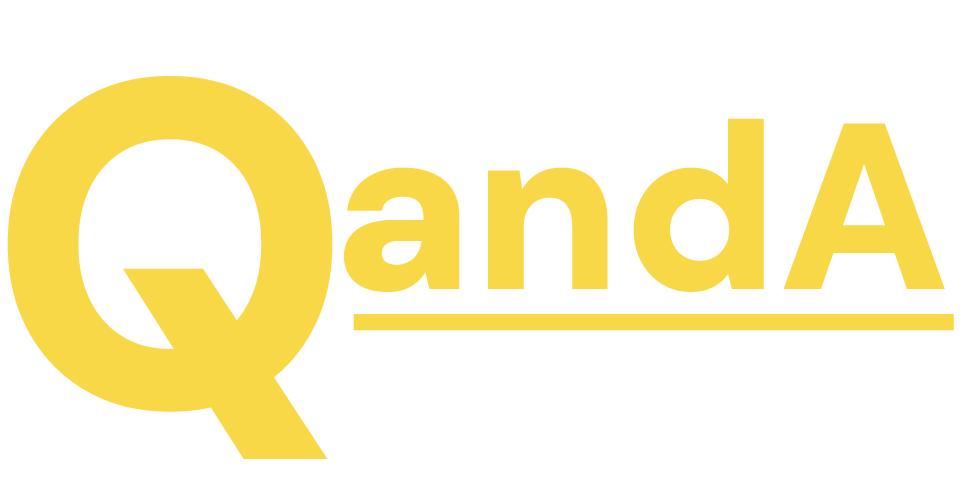

### Take learning to new heights

---

## Description

___Qanda___ stands as a digital odyssey, where each quiz question is a gateway to deeper 
understanding. More than a website, it's a confluence for thinkers and dreamers, a catalyst for curiosity.

___Qanda___ rewrites the rules of learning, inviting users to explore the frontiers of knowledge, one question at a time.

## Info

The task involves developing a full-stack web application for a quiz platform as part of the IDATT2105 course in 2024. The application must include a Vue.js frontend, a Java and Spring Boot backend, and utilize MySQL or H2 for the database. The platform should enable users to create, manage, and take quizzes for educational or entertainment purposes.

### Table of Contents

- [Description](#description)
- [Info](#info)
- [Table of Contents](#table-of-contents)
- [Basic Setup Guide](#basic-setup-guide)
  - [Commands](#commands)
- [Documentation](#documentation)
- [Developers](#developers)

## Basic Setup Guide

The minimum setup requires [Docker Desktop](https://www.docker.com/products/docker-desktop/) installed on the machine.

To pull the project, clone the project using [git](https://git-scm.com/downloads). 

### Commands

In the root folder of the project:

After cloning the repository, the first time you want to run the program, run:
(PS: Make sure Docker Desktop is running)

```bash
docker-compose build
```

```bash
docker-compose up -d
```

If you have already ran the program using Docker once, and have made changes to the code, you will need to run this before the two previous commands:

```bash
docker-compose down
```

## Documentation

- [SpringBoot Backend](https://github.com/Eliastrana/FullStackProject/tree/main/Backend)
- [Vue Frontend](https://github.com/Eliastrana/FullStackProject/tree/main/Frontend)
- MySQL Database


## Developers

- [Elias Trana](https://github.com/Eliastrana)
- [Erik Nordsæther](https://github.com/eriktur)
- [Sander Rom Skofsrud](https://github.com/SanderSkofsrud)
- [Vegard Johnsen](https://github.com/VegardJohnsen)

## Contact Information

If You have trouble running the project, questions or feedback, feel free to contact us at:

- [Support](mailto:support@quand.no)
- [Feedback](mailto:support@quand.no)
